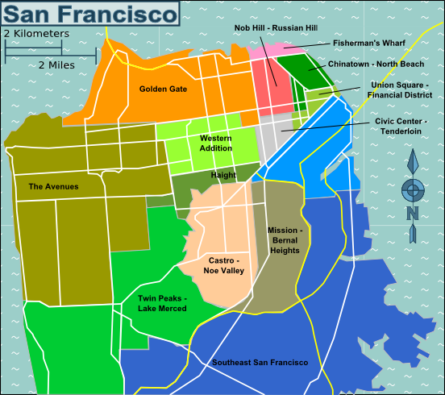

# SF Districts in the style of Andy Warhol

<!-- pyml disable-num-lines 5 line-length -->

[//]: # "To generate `stub_data/duplicate_media.pdf` from this:"
[//]: # "1. `pandoc duplicate_media_template.md --standalone --katex -t html -o temp.html`"
[//]: # "2. `Chromium --headless --disable-gpu --print-to-pdf=stub_data/duplicate_media.pdf --no-pdf-header-footer temp.html`"
[//]: # "3. `rm temp.html`"

Text under image 1.

| Col1  | Col2  |
| ----- | ----- |
| Val11 | Val12 |
| Val21 | Val11 |

Text under table 1.

Inline LaTeX: $E = mc^2$

Block LaTeX:

$$
x + n + a = \sqrt{ax + (n + a)^2 + x \sqrt{a (x + n) + (n + a)^2 + (x + n) \sqrt{\dots}}}
$$

Text under image 2.

| Col1  | Col2  |
| ----- | ----- |
| Val11 | Val12 |
| Val21 | Val11 |

Text under table 2.

Inline LaTeX: $E = mc^2$

Block LaTeX:

$$
x + n + a = \sqrt{ax + (n + a)^2 + x \sqrt{a (x + n) + (n + a)^2 + (x + n) \sqrt{\dots}}}
$$

Text under image 3.

| Col1  | Col2  |
| ----- | ----- |
| Val11 | Val12 |
| Val21 | Val11 |

Text under table 3.

Inline LaTeX: $E = mc^2$

Block LaTeX:

$$
x + n + a = \sqrt{ax + (n + a)^2 + x \sqrt{a (x + n) + (n + a)^2 + (x + n) \sqrt{\dots}}}
$$

Text under image 4.

| Col1  | Col2  |
| ----- | ----- |
| Val11 | Val12 |
| Val21 | Val11 |

Text under table 4.

Inline LaTeX: $E = mc^2$

Block LaTeX:

$$
x + n + a = \sqrt{ax + (n + a)^2 + x \sqrt{a (x + n) + (n + a)^2 + (x + n) \sqrt{\dots}}}
$$

Text under image 5.

| Col1  | Col2  |
| ----- | ----- |
| Val11 | Val12 |
| Val21 | Val11 |

Text under table 5.

Inline LaTeX: $E = mc^2$

Block LaTeX:

$$
x + n + a = \sqrt{ax + (n + a)^2 + x \sqrt{a (x + n) + (n + a)^2 + (x + n) \sqrt{\dots}}}
$$
